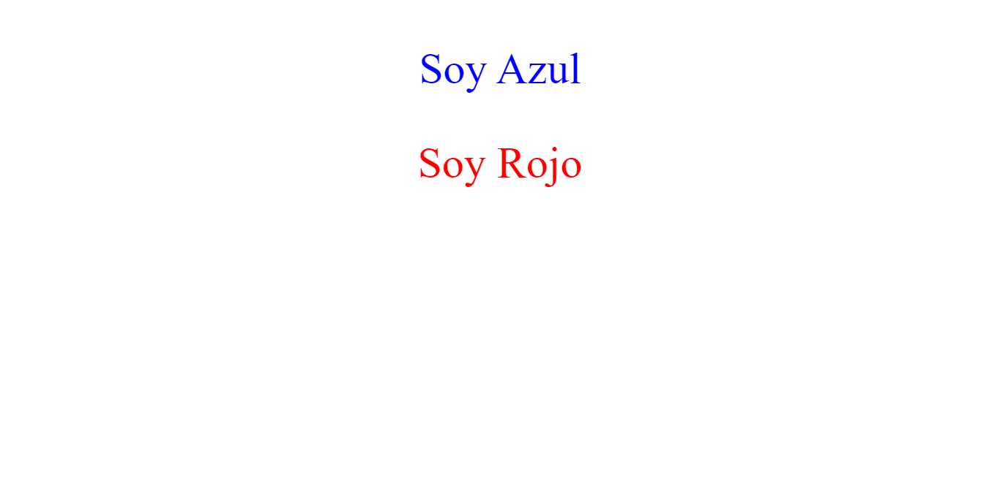
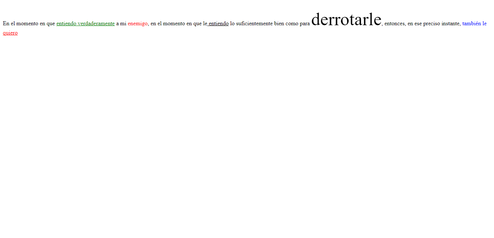
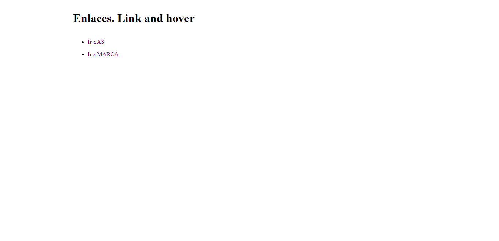
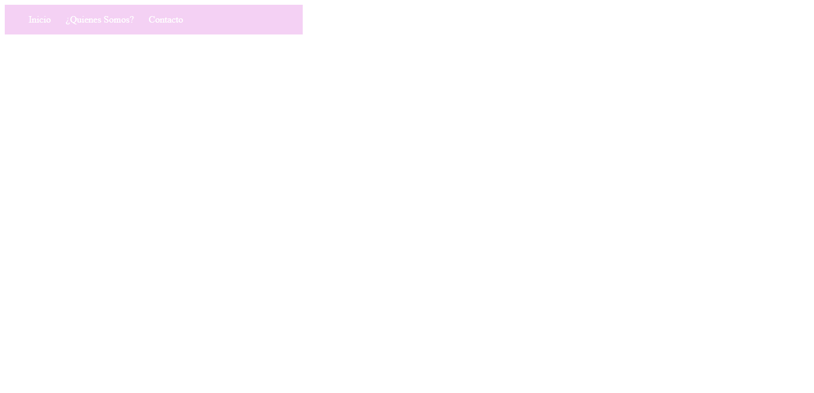
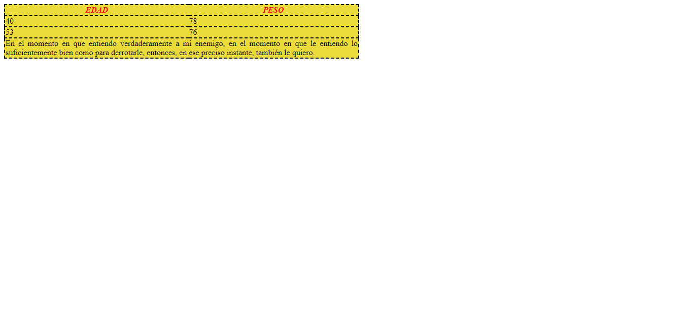

<h1>Taller 9 Diego Alexander Baron Bernal</h1>

<h2> Información</h2>

Curso: full Stack Basico - Grupo 1

Profesor: Cristian Patiño

 Link Página Web 

<a href="https://github.com/Diegobdevf/taller-9-full-stack" target="_blank"> Link Página Web</a>

<h2> Punto 1: Link figma</h2>

<a href="https://www.figma.com/file/oswqfvV5WkFeWPVds7mbSf/Diego-Alexander-Bar%C3%B3n-Bernal?type=design&node-id=0%3A1&mode=design&t=jRlk2cwiKe875LaE-1" target="_blank">Link de Figma</a>

<h2>Punto 2: HTML</H2>

<h2>Punto 3: CCS del diseño</H2>

<h2>Punto 4: Mostrar texto solicitado</H2>

<h2>Punto 5: Parrafo</H2>

<h2>Punto 6: Links</H2>

<h2>Punto 7-8: Navegacion</H2>

<h2>Punto 9: Tabla</H2>

